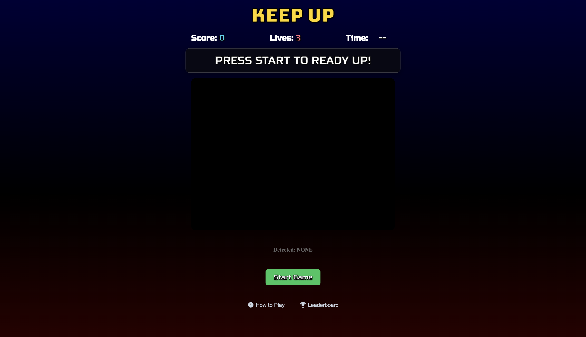
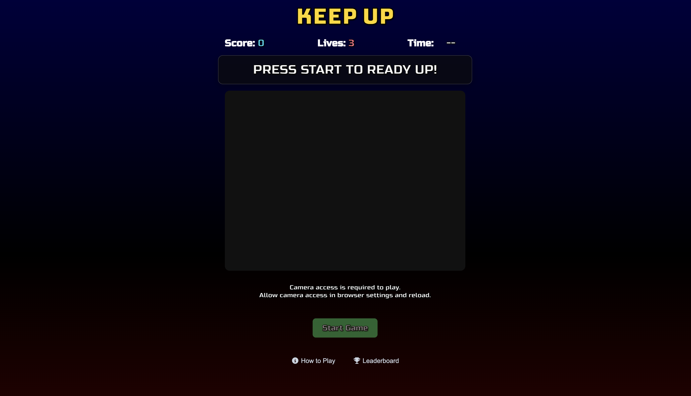
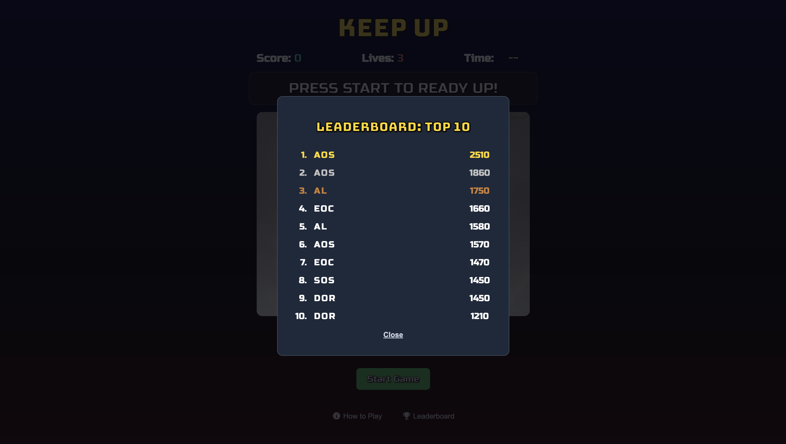
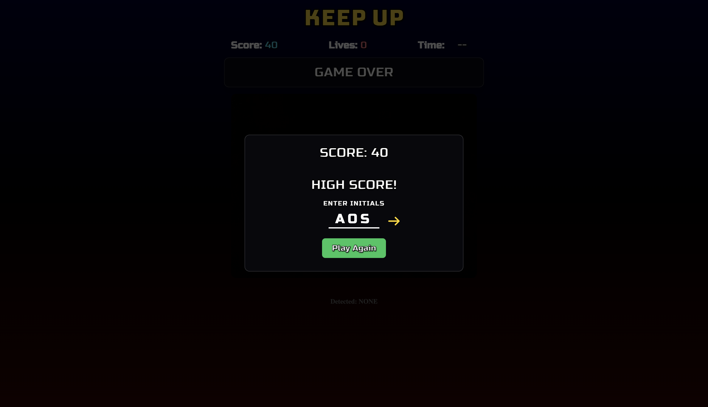

# Keep Up Mini-Game
**Author:** Alex O'Sullivan

Keep Up is a browser-based motion game that uses the player's webcam to detect
gestures in real time. Players must perform the displayed gesture before the timer runs 
out.

The game gets progressively faster as the score increases, with high scores saved to a 
global top 10 leaderboard.

## Live Demo
[Try Keep Up Here](https://keep-up-one.vercel.app)
> Camera access is required to play.

## Features
- Real-time gesture recognition
- Multiple gesture commands
- Progressive difficulty
- Score tracking
- Sound effects and game feedback
- Global top 10 leaderboard
- Persistent score storage

## Tech Stack
### Frontend
- Angular
- TypeScript
- HTML
- CSS
- MediaPipe

### Backend
- Java
- Spring Boot
- Spring Data JPA
- REST API

### Database
- MySQL

### Deployment
- Vercel - frontend
- Railway - backend and database

### Architecture
The Angular frontend handles gameplay, webcam input, gesture recognition, and 
the user interface, while the Spring Boot backend manages leaderboard scores 
through a REST API with MySQL for persistent storage.

## Testing
The backend includes unit tests for the score service and integration tests for the API, 
covering score validation, leaderboard qualification, score submission, and retrieval.

The deployed application was also tested to ensure camera access, gesture 
recognition, gameplay, and leaderboard persistence work as expected.

## Screenshots

### Main Screen

### Camera Access Required

### Leaderboard

### Highscore Screen
